# Project 2 - GOAL-KR

**🎯 Hit your mark. Achieve success!**

A web application created by Leah Livingston

---
### **Project Idea and Description**
Ever dream of achieving your personal goals with the same precision and focus as the Fortune 100 companies? Look no further. This project brings the power of OKRs to your fingertips. 

###### What's an OKR?
OKR, short for [objectives and key results](https://www.forbes.com/advisor/business/what-is-an-okr-definition-examples/), is a proven goal-setting tool that holds accountability, tracks progress, and helps to achieve milestones that might seem "just out of reach". Imagine setting a [BHAG goal](https://asana.com/resources/bhag-big-hairy-audacious-goal), aligning it with your deepest desire, and having a clear roadmap to success!

###### Why do I need this?
* **Accountability**: Stay on course, achieve your dreams, and watch your progress
* **Focus**: Laser-focus on what truly matters to you (and future you)
* **Motivation**: Experience the thrill of accomplishment as you move closer to your dreams, one milestone at a time.

###### Is this right for me?
* Are you longing to buy a house but struggle to save that initial deposit?
* Do you dream of a healthier lifestyle but find yourself ordering takeout more often than hitting the gym?
* Have you always wanted to write a book but can't find time in your hectic schedule?

*You're not alone!* 

Life happens, and that's why OKRs are the secret weapon that you should be using.

---
### **Tech Stack**
It's an Express web application framework for Node.js employed with HTML, CSS, & JavaScript, MongoDB & oAuth.

---
## ERDs

---
### **Restful Routing Chart**

---
### **Wireframes of your game**
The minimum viable product (MVP) goal is a functional OKR tool with basic CSS styling.

###### Landing Page
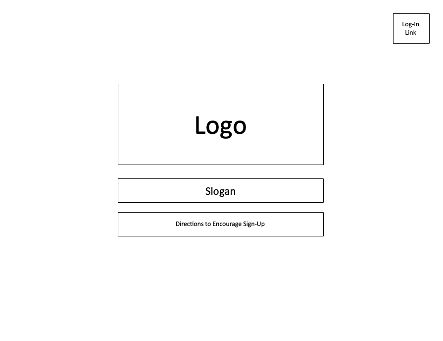
---
###### Home Page
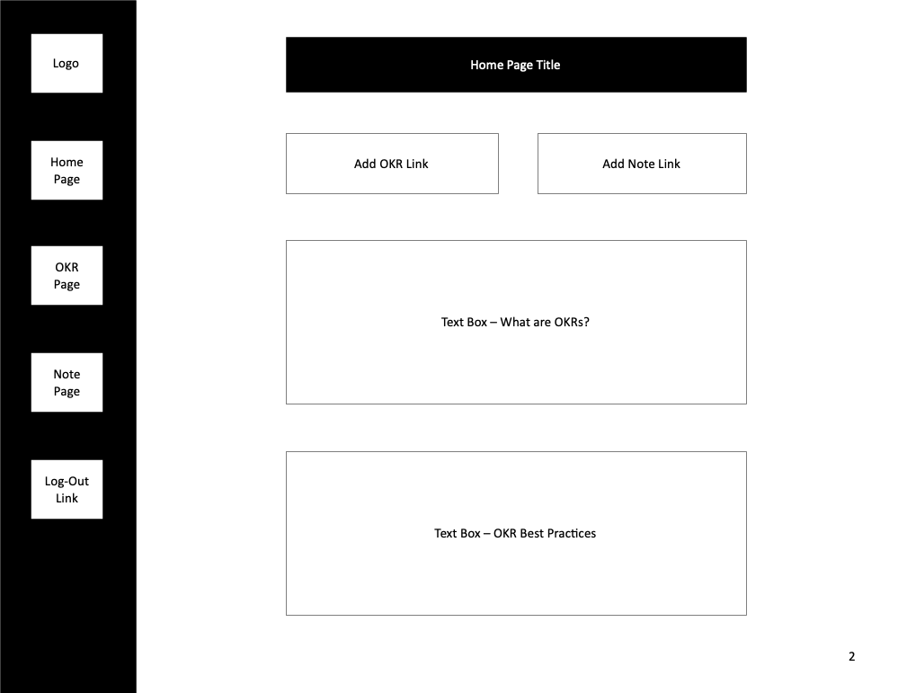
---
###### OKR Page Options
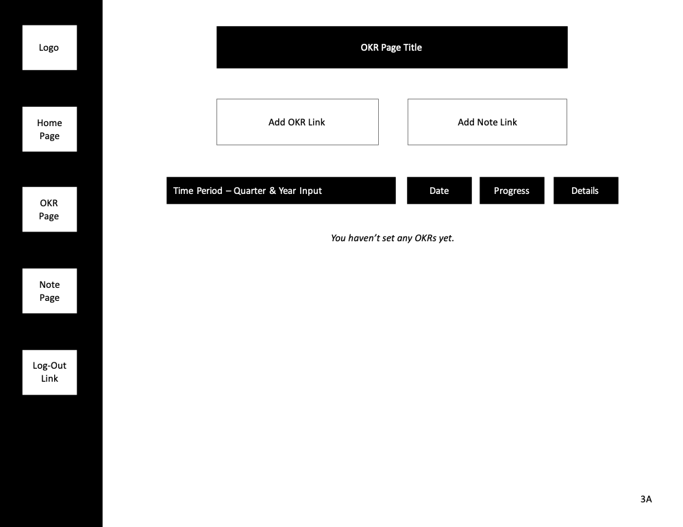
---
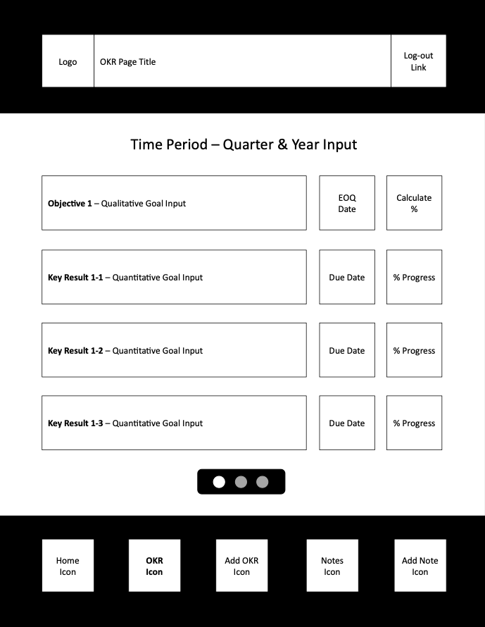
---
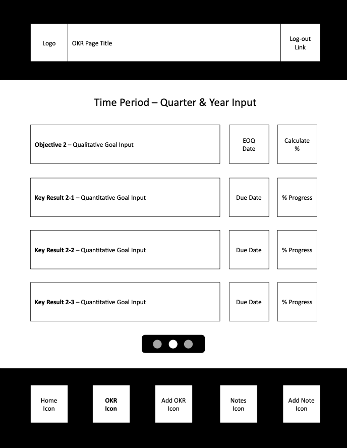
---
###### Add OKR Page
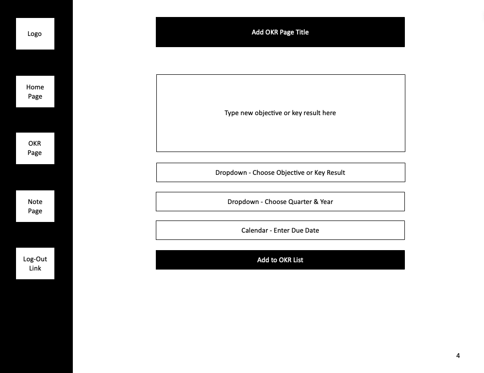
---
###### OKR Detail Page Options
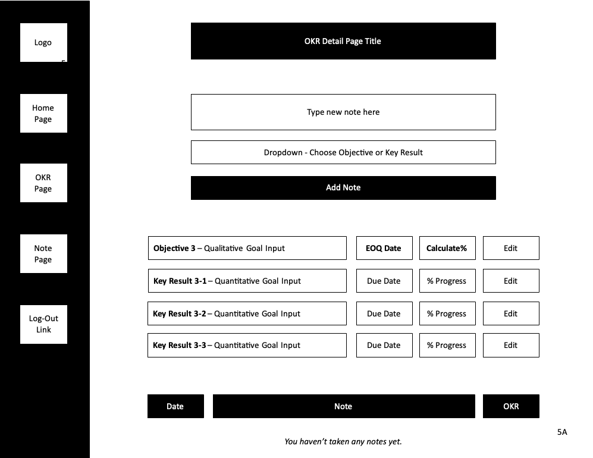
---
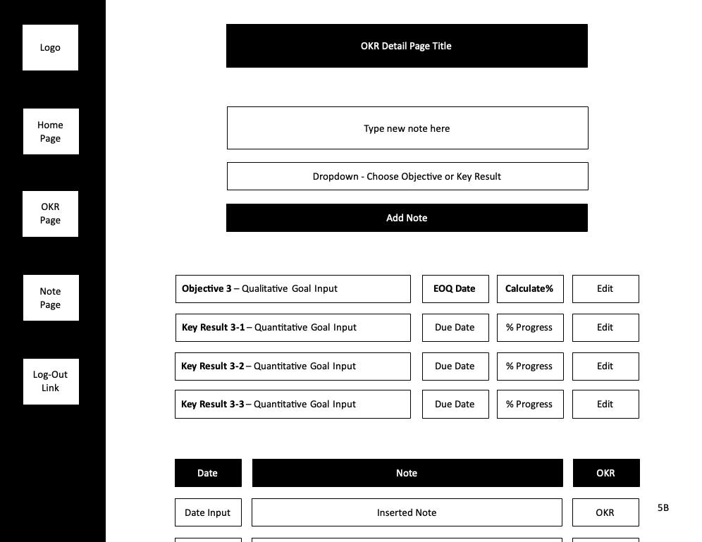
---
###### Update OKR Page
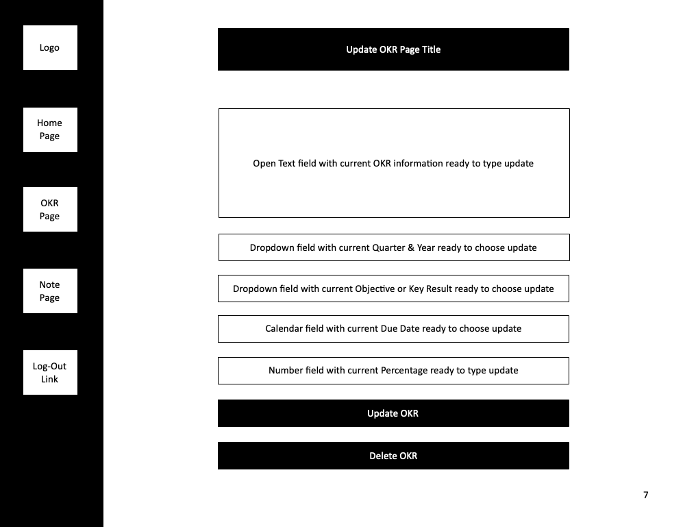
---
###### Note Page Options
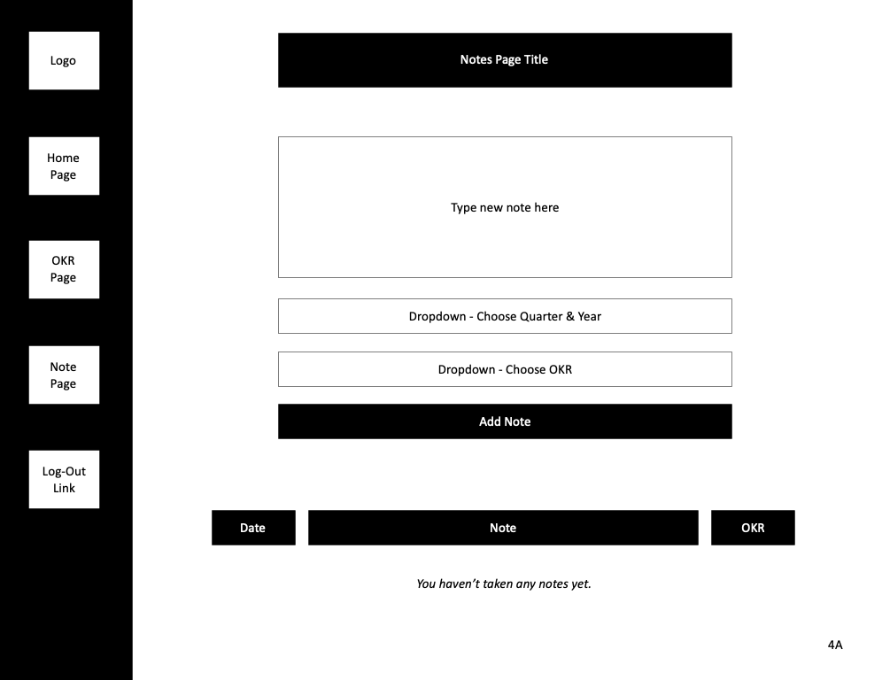
---
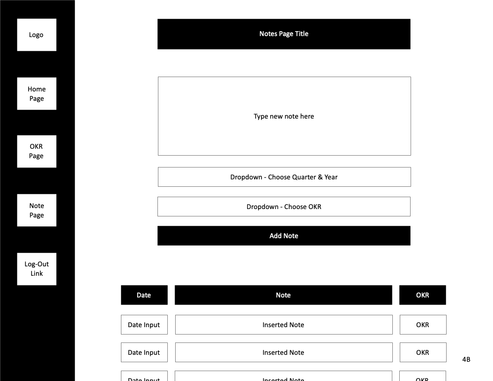

---
### **User Stories**
- [ ] AAU, I the ability to track my quarterly objectives and key results (OKRs) for written accountability towards my personal goals
- [ ] AAU, I want the ability to log-in with my Google account credentials
- [ ] AAU, I do not want other people to see my individual OKRs
- [ ] AAU, I want the ability to update my OKRs (i.e. increase percentage to goal or update spelling mistakes)
- [ ] AAU, I want the ability to add notes to track personal progress throughout the quarter

---
### **MVP Goals**

###### Style
- [ ] Include basic CSS to ensure functionality works
- [ ] Include left column navigation including 'Logo' icon, 'Home' page, 'OKR' page, 'Note' page & 'Log Out' button
- [ ] Include individual page views of 'Home' screen, 'All OKRs' screen, 'All Notes' screen, 'Add an OKR' screen, 'Add a Note' screen, 'OKR Details' screen, & 'Update OKR' screen
- [ ] Optimization for desktop & tablet

###### Functionality
- [ ] Include a landing page with ability to log-in via oAuth
- [ ] Include ability to log-out after logging-in
- [ ] Include ability to add / update / delete individual objectives & key results (OKRs) 
- [ ] Include ability to add a Note
- [ ] Optimization for desktop & tablet  
- [ ] Objective's percentage progress is calculated automatically based off individual percentages

---
### **Stretch Goals**

###### Style
- [ ] Includes CSS styling following brand kit
- [ ] Completed brand kit for future development use
- [ ] Optimization for mobile

###### Functionality
- [ ] Include ability to update / delete Notes 
- [ ] Optimization for mobile
- [ ] Ability to update existing OKRs & Notes in same screen (rather than being directed to a new screen)
- [ ] Ability to archive a quarter's OKRs into historical view (or listed below current OKRs)
- [ ] Ability to set annual goals & break into quarterly chunks for long-term planning
- [ ] Home screen analytics showing progress over time
- [ ] Notification / Email reminders for regular progress check-ins
- [ ] Ability to join group (i.e. family, friend or professional group) to work toward shared common goals
- [ ] Ability to share progress with family members / friends