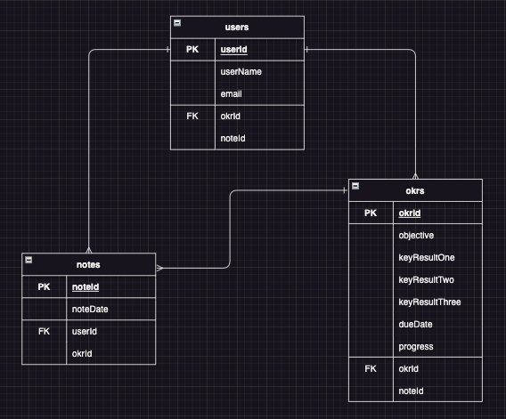

# Project 2 - GOAL-KR

**🎯 Hit your mark. Achieve success!**

A web application created by Leah Livingston

---
### **Project Idea and Description**
Ever dream of achieving your personal goals with the same precision and focus as the Fortune 100 companies? Look no further. This project brings the power of OKRs to your fingertips. 

###### What's an OKR?
OKR, short for [objectives and key results](https://www.forbes.com/advisor/business/what-is-an-okr-definition-examples/), is a proven goal-setting tool that holds accountability, tracks progress, and helps to achieve milestones that might seem "just out of reach". Imagine setting a [BHAG goal](https://asana.com/resources/bhag-big-hairy-audacious-goal), aligning it with your deepest desire, and having a clear roadmap to success!

###### Why do I need this?
* **Accountability**: Stay on course, achieve your dreams, and watch your progress
* **Focus**: Laser-focus on what truly matters to you (and future you)
* **Motivation**: Experience the thrill of accomplishment as you move closer to your dreams, one milestone at a time.

###### Is this right for me?
* Are you longing to buy a house but struggle to save that initial deposit?
* Do you dream of a healthier lifestyle but find yourself ordering takeout more often than hitting the gym?
* Have you always wanted to write a book but can't find time in your hectic schedule?

*You're not alone!* 

Life happens, and that's why OKRs are the secret weapon that you should be using.

---
### **Tech Stack**
It's a web application hosted on Heroku utilizing the Express framework for Node.js employed with HTML, CSS, and JavaScript, MongoDB & oAuth.

---
## ERDs

---
### **Restful Routing Chart**
| HTTP METHOD (_Verb_) | URL (_Nouns_) | CRUD | Response | Notes |
| -------------------- | ------------- | ---- | -------- | ----- |
<!-- | `full index of items`  |   |   |   |   | -->
<!-- | GET | `/users` | Read (index) | Array of users `{ [ user, user ] }` | retrieves the index list of all users | -->
| GET | `/okrs` | Read (index) | Array of okrs `{ [ okr, okr ] }` | retrieves the index list of all okrs |
| GET | `/notes` | Read (index) | Array of notes `{ [ note, note ] }` | retrieves the index list of all notes |
<!-- | `individual items`  |   |   |   |   | -->
<!-- | GET | `/users/:userId` | Read (show) | User details | shows a specific user's details | -->
| GET | `/okrs/:okrId` | Read (show) | OKR details | shows a specific OKR's details |
<!-- | GET | `/notes/:noteId` | Read (show) | Note details | shows a specific note's details | -->
<!-- | `adding items to index`  |   |   |   |   | -->
| POST | `/users` | Create | Add a user | add a user to database |
| POST | `/okrs` | Create | Add a okr | add a okr to database|
| POST | `/notes` | Create | Add a note | add a note to database |
<!-- | `removing items from index`  |   |   |   |   | -->
<!-- | DELETE | `/users` | Destroy | Delete a user | remove a user from database | -->
| DELETE | `/okrs` | Destroy | Delete an okr | remove an okr from database |
<!-- | DELETE | `/notes` | Destroy | Delete a note | remove a note from database | -->
<!-- | `updating items in index`  |   |   |   |   | -->
| PUT | `/okrs/:okrId` | Update | Update OKR | update a specific OKR's details |
<!-- | PUT | `/notes/:noteId` | Update | Update Note | update a specific note | -->
<!-- | PUT | `/users/:userId` | Update | Update User | update a specific user's details | -->
<!-- | POST | `/notes/:noteId/okrs` | Create | Add an OKR to a Note | adds an OKR to a specific note | -->
<!-- | DELETE | `/okrs/:okrId/notes` | Destroy | Remove a Note from an OKR | removes a note from a specific OKR | -->

---
### **Wireframes of your game**
The minimum viable product (MVP) goal is a functional OKR tool with basic CSS styling.

###### Landing Page

---
###### Home Page

---
###### OKR Page Options

---

---

---
###### Add OKR Page

---
###### OKR Detail Page Options

---

---
###### Update OKR Page

---
###### Note Page Options

---

---
### **User Stories**
- [ ] AAU, I want the ability to track my OKRs for written accountability and motivation.
- [ ] AAU, I want the ability to log-in with my Google account credentials.
- [ ] AAU, I do not want other people to see my individual OKRs.
- [ ] AAU, I want the ability to update my OKRs (i.e. increase percentage to goal or update spelling mistakes).
- [ ] AAU, I want the ability to add notes to track personal progress throughout the quarter.

---
### **MVP Goals**

###### Style
- [ ] Include basic CSS to successfully utilize OKR tool
- [ ] Include left column navigation including 'Logo' icon, 'Home' page link, 'OKR' page link, 'Note' page link and 'Log-out' button
- [ ] Include 7 individual page views, including:  'Home' screen, 'All OKRs' screen, 'All Notes' screen, 'Add an OKR' screen, 'Add a Note' screen, 'OKR Details' screen, and 'Update OKR' screen
- [ ] Include visual optimization for desktop and tablet

###### Functionality
- [ ] Include a landing page with ability to log-in via oAuth
- [ ] Include ability to log-out after logging-in
- [ ] Include ability to add / update / delete individual OKRs
- [ ] Include ability to add a Note
- [ ] Include ability for private view of individual OKRs and Notes (logged-in user can only see their own input)
- [ ] Include optimized functionality for desktop and tablet  
- [ ] Include ability for percentage progress to be calculated automatically based off key result percentages

---
### **Stretch Goals**

###### Style
- [ ] Include CSS styling following a 'Brand Kit'
- [ ] Include a 'Brand Kit' for future development use
- [ ] Include visual optimization for mobile

###### Functionality
- [ ] Include ability to update / delete Notes 
- [ ] Include optimization for mobile
- [ ] Include ability to update existing OKRs and Notes in same screen (rather than being directed to a new screen)
- [ ] Include ability to archive a quarter's OKRs into historical view (or listed below current OKRs)
- [ ] Include ability to set annual goals and break into quarterly chunks for long-term planning
- [ ] Improve home page analytics to show progress over time
- [ ] Add notification / Email reminders for regular progress check-ins
- [ ] Include ability to join a group (i.e. family, friend or professional group) to work toward shared common goals
- [ ] Include ability to share progress with family members / friends on home page