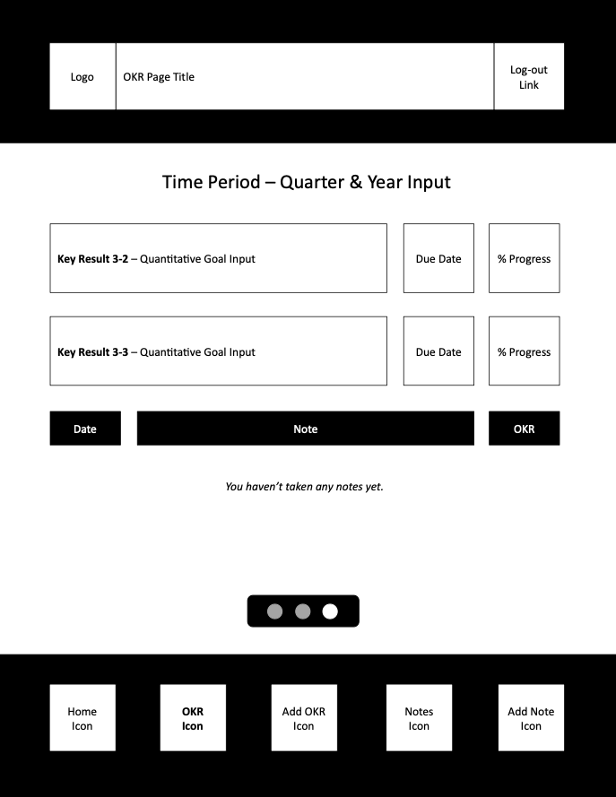

# Project 2 - GOAL-KR

A web application created by Leah Livingston

[Click Here to Check out the App Now](https://goalkr-94864ed83738.herokuapp.com)

---
### **Project Idea and Description**
Do you dream of achieving personal [BHAG goals](https://asana.com/resources/bhag-big-hairy-audacious-goal), but get overwhelmed thinking about how to get there?

*You're not alone.* 

This project was created to help individuals adopt the same precision and focus as Fortune 100 companies. Set challenging objectives with measurable key results. Align these with a long-term strategy to create your personal roadmap to success. Bring the power of OKRs to your life, and empower your future.

###### What's an OKR?
Short for [objectives and key results](https://www.forbes.com/advisor/business/what-is-an-okr-definition-examples/), OKRs are a proven goal-setting tool that holds you accountable, tracks your progress, and helps you achieve milestones that might seem "just out of reach". 

###### How does it work?
* **Accountability** - Write it down, regularly check-in, and grade your results to pivot when necessary 
* **Laser Focus** - Hone in on what truly matters to you (and future you)
* **Motivation** - Experience the thrill of accomplishment, one milestone at a time

OKRs are the secret weapon consulting firms deploy at large organizations. Do the same with your life.

**🎯 Hit your mark. Achieve success!**
[Click Here to Check out the App Now](https://goalkr-94864ed83738.herokuapp.com)

---
### **Tech Stack**
It's a web application hosted on Heroku utilizing the Express framework for Node.js employed with HTML, CSS, and JavaScript, MongoDB & oAuth.

---
## ERDs

---
### **Restful Routing Chart**
| HTTP METHOD | URL | CRUD | Response | Notes |
| -------------------- | ------------- | ---- | -------- | ----- |
| `full index of items`  |   |   |   |   |
| GET | `/okrs` | Read (index) | Array of OKRs `{ [ okr, okr ] }` | retrieves the index list of all OKRs |
| GET | `/notes` | Read (index) | Array of Notes `{ [ note, note ] }` | retrieves the index list of all notes |
| `individual items`  |   |   |   |   |
| GET | `/okrs/:okrId` | Read (show) | OKR Details | shows a specific OKR's details |
| `adding items to index`  |   |   |   |   |
| GET  | `/oauth/google`  | Read (show) | oAuth Log-in  |  oAuth log-in to add a user with their Google credentials | 
| GET  | `/oauth2callback`  | Read (show) | oAuth Failed Log-in |  existing user, but failed oAuth log-in |
| POST | `/users` | Create | Add a User | add a user to database |
| POST | `/okrs` | Create | Add an OKR | add an OKR to database |
| POST | `/okrs/:okrId/notes` | Create | Add a Note | add a note to database |
| `removing items from index`  |   |   |   |   |
| DELETE | `/okrs/:okrId` | Destroy | Delete an OKR | remove an OKR from database |
| `updating items in index`  |   |   |   |   |
| PUT | `/okrs/:okrId` | Update | Update OKR | update a specific OKR's details |

---
### **Wireframes of your game**
The minimum viable product (MVP) goal is a functional OKR tool with basic CSS styling.

###### Landing Page

---
###### Home Page Options

---

---

---
###### OKR Page Options

---

---

---

---

---

---
###### Add OKR Page

---
###### OKR Detail Page Options

---

---
###### Update / Delete OKR Page

---
###### Note Page Options

---

---
###### Add Note Page

---
### **User Stories**
- [ ] AAU, I want the ability to track my OKRs for written accountability and motivation.
- [ ] AAU, I want the ability to log-in with my Google account credentials.
- [ ] AAU, I do not want other people to see my individual OKRs.
- [ ] AAU, I want the ability to update my OKRs (i.e. increase percentage to goal or update spelling mistakes).
- [ ] AAU, I want the ability to add notes to track personal progress throughout the quarter.

---
### **MVP Goals**

###### Style
- [ ] Include basic CSS to successfully utilize OKR tool
- [ ] Include left column navigation including 'Logo' icon, 'Home' page link, 'OKR' page link, 'Note' page link and 'Log-out' button
- [ ] Include 7 individual page views, including:  'Home' screen, 'All OKRs' screen, 'All Notes' screen, 'Add an OKR' screen, 'Add a Note' screen, 'OKR Details' screen, and 'Update OKR' screen
- [ ] Include visual optimization for desktop and tablet
- [ ] Home page buttons to click to the next (i.e.[ okr1 ]  [ ok2 ]   [ okr3 ] )

###### Functionality
- [ ] Include a landing page with ability to log-in via oAuth
- [ ] Include ability to log-out after logging-in
- [ ] Include ability to add / update / delete individual OKRs
- [ ] Include ability to add a Note
- [ ] Include ability for private view of individual OKRs and Notes (logged-in user can only see their own input)
- [ ] Include optimized functionality for desktop and tablet  
- [ ] Include ability for percentage progress to be calculated automatically based off key result percentages

---
### **Stretch Goals**

###### Style
- [ ] Include CSS styling following a 'Brand Kit'
- [ ] Include a 'Brand Kit' for future development use
- [ ] Include visual optimization for mobile
- [ ] Add ability to swipe left / right on screen for Homepage & OKR view options

###### Functionality
- [ ] Include ability to update / delete Notes 
- [ ] Include optimization for mobile
- [ ] Include ability to update existing OKRs and Notes in same screen (rather than being directed to a new screen)
- [ ] Include ability to archive a quarter's OKRs into historical view (or listed below current OKRs)
- [ ] Include ability to set annual goals and break into quarterly chunks for long-term planning
- [ ] Improve home page analytics to show progress over time
- [ ] Add notification / Email reminders for regular progress check-ins
- [ ] Include ability to join a group (i.e. family, friend or professional group) to work toward shared common goals
- [ ] Include ability to share progress with family members / friends on home page